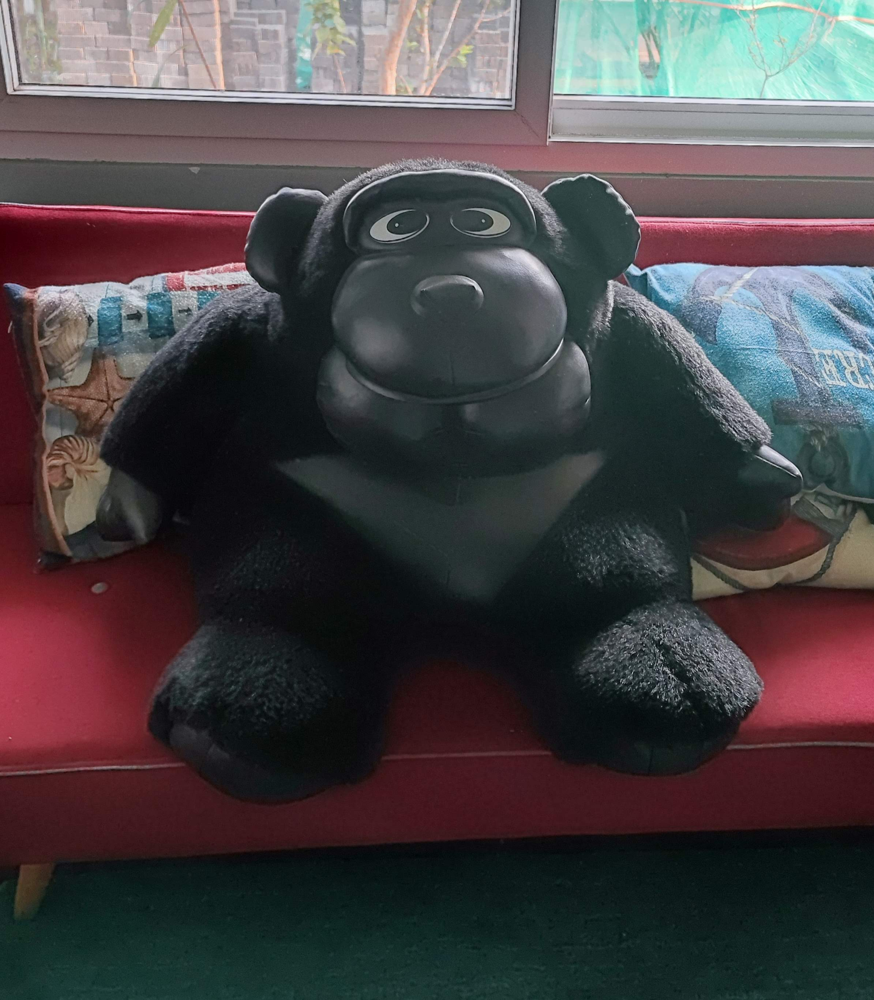

[<<  Back to Index](index.md)

### The Proposal

27 March 2002. 
She got up with all the excitement of a child on her birthday. She was going to be 22! The house in Bangalore that she shared with her seniors from college, was busily engaged in the morning rituals to leave for office. Today she wanted to get up early,  go to the office early, so that she could savor more of the day. To add to her excitement, she was going home to Kochi in the evening for an extended weekend. 

The telephone kept ringing with birthday wishes from her family and her friends who were no longer in Bangalore. She had a letter from her father and her sister. When she got a gap, she quickly took a shower and had to rush out in house clothes to attend to the telephone that was ringing again. Her housemates were almost ready, walking in and out of rooms in the last minute rush. Two of them had already left for the office, keeping the front door open.

She was settling down on the mattress sprawled on the floor to attend to the telephone. She does not remember who it was on the phone, but her eyes were in the direction of the open front door, and she froze. He was standing there, in front of her house, looking embarrassed and totally out of place. 
Her first thought was, what would the girls in the house think? Did they see him? 

She said something into the phone and  quickly came out and tried to pull him out of the gate. He whispered "Happy Birthday, I wanted to give this to you". Then she saw it - A huge box which could easily fit a person inside. She was in shock as she asked "How did you bring this here". He sheepishly answered "I walked with it".  Her eyes became wider and wider - "All this way? On the roads? Didn't people see you?". He laughed nervously -  "It didn't seem so stupid before, but now I am not sure". 

She didn't have time to stand there and argue, she didn't want to think too much about it. She shooed him away saying she'd meet him in the office, and laboriously took the box in. Only two of her roommates were still in the house. Seeing their questioning glances, she replied. "It is a gift from my team in Cisco, he was asked to deliver it since he stays close by." They were blown away. "Wow! what a company, we should be working for such companies. Come, let's open it." Seeing their exclamations of friendly envy about the personal care of her company, she felt guilty and embarrassed about her lie. 

She was just not ready to talk about him to anyone, let alone her roommates who were not even friends. What was he to her anyway? He was a friend, she had many friends. Right, a friend who stupidly walked through the busy morning Indiranagar streets looking like a fool to personally deliver the huge gift wrapped birthday gift and wish her. Wait, but that was not her problem, just his foolishness. Then why was she embarrassed about telling the truth? She was afraid that nobody would be as foolish as her to believe that he was just a friend.

Frankly she was afraid to open it with them. What if the contents revealed nothing that would look like a team gift, what if they were more personal? She was not sure if she was feeling angry with him then, or sorry for him, or feeling overwhelmed altogether. Her quota of lies were over for a lifetime, and she decided to brave it and open it. What was inside made her grin from ear to ear. A big black gorilla - the only one she had ever seen in her life in an Archies showroom in Bangalore. There was no card, no personal note, no explanation! (It was very clear that he hasn't done much 'gifting' in his life)

The girls didn't seem to think anything odd - Girls having stuffed toys from teddy bear to tweety birds were common in those days (maybe they were too immature to have real pets then) - and going by the 'status' of Cisco, they just assumed that they'd send her the biggest stuffed toy available in the market. Both the girls walked around, touched and examined the gorilla, seemed satisfied , said "we'll name it in the evening", and left for the office. 

If they were not in a hurry, and if they were puzzled by why a gorilla and not a regular teddy bear, she had a story, which was not a lie. Flashback two months back to when he called her to go shopping with him to select a gift for his sister's wedding anniversary. He said he was clueless since he never had any money to gift her anything from Archies or such expensive places. They entered the colourful huge Archies store in Brigade road and the first thing that caught her eye, the showstopper for her, was this huge gorilla sitting royally on a shelf. He seemed to dwarf every stuffed animal around it. She was not able to look at anything else, nothing else caught her eye while it was there. It was far too prominent to ignore. She said "wow, gift her this." They were aghast when they saw the price, and he was very skeptical since it was not anything like what you'd conventionally call cute. It might even look big and scary to some. He was skeptical -  "Would she like it?" She replied, laughing "I would be very glad if someone got me this. Also, it might remind her of you, look, the eyes are the same!".  It was not a very serious conversation, something that probably lasted hardly 2 minutes before they moved onto more practical, affordable and sensible options for gifting a sister who was married.

On March 27 2002,  she didn't know that this was going to change things for both of them. She was far too absorbed in her own special day, she was expecting the world to shower her with their wishes and blessings. Till then she was playing hide and seek with him, she would not let him say the dreaded "I love you", she didn't want to lose him as long as she could. If he had taken out the ring then, she could have easily said "No', but he was smart. He just gave her a birthday gift, but went through the same hoops any guy would happily go through, for the person he wants to spend the rest of his life with... publicly, unabashedly. He knew she'd say No if asked the question, and he was just not ready to take No for an answer. Without asking, he was telling her "I would do anything for you, I would move mountains for you, will you be mine?" 

She carefully dressed up, packed her bags for the evening trip home, and left for office cheerful and with a singing heart. She was very happy that day and she believed that it was because it was her birthday. She had many friends and admirers in the office and she had many gifts - flowers and cards - waiting at her desk . He was waiting with a smile for their daily coffee, had a "You look so beautiful" look on his face which she promptly ignored, and he was mocking her about the red cards and flowers from other boys at her desk. 

"Scarlett O Hara", he would tease. That was whom she reminded him of , he had said, the very first week after they met. She didn't know who she was - the heroine of "Gone with the wind", she hadn't read the book or seen the movie. She asked Surabhi and she seemed to think that it was an insult because Scarlett O Hara was not an ideal woman according to her. She ignored that too, until she came across Linda Goodman's description of Aries women. 

_"Scarlett O’Hara is the very epitome of the Mars-ruled
Aries female. Like Scarlett, the Aries girl will gather every available male for a hundred miles around to her feet, while her willful heart yearns for the one man she can’t have for one reason or another."_

She was impressed then - for he had absolutely no clue about sun signs or Linda Goodman .. and she was Aries! But right now, he was clearly mocking at the huge red cards at her desk.

During coffee, they discussed the aftermath of his visit and she said that the girls were already emailing her names for the gorilla. He asked "so what have you decided to name it?'' The Scarlett O Hara remark was still in her mind so she said  "I am going to name him "Rhett", and I am going to ignore all other boys and love ONLY him for the rest of my life." He seemed amused. 

He asked her if he could come with her in the auto to the bus stop, and she happily agreed. Her day had started with her thinking only about herself and her birthday, but by the time it ended she could think only about him. When she went home she talked to her parents about him, that she's afraid that she liked him.. If it was ever possible to think of marrying him. 
(To the modern and unaware generation : The possibiltiy factor of a Kerala Muslim girl marrying a vegetarian Tamil Iyer/Brahmin)

Her mother was very sad when she replied to her - "We have tried our best to fulfil every wish of yours. But you cannot ask us for the moon, it just isn't fair"
In her own heart she was afraid that was true, it was unfair on her parents. She thought about Rhett in the Archies showroom, totally out of place there, waiting to be in a better home and heart. He deserved the answer as soon as possible. 

From home, over the chat she conveyed to him that they were just dreaming impossible dreams. It was time to wake up, stop all this nonsense, and come back to senses. He asked her if she would be happy. She said yes, anyway how do we know .. Happiness is something you experience, not something you can anticipate. He told her not to worry about anything and just go with whatever makes her happy.
She resolved that she was never going to tell him about the conversation she had with her parents, that she actually told them that she liked him, because she knew that at the slightest sign of encouragement he would pull her to the other side.

She thought that she'd forget about all this, and take life one day at a time. But ever since Rhett came into her life, she was finding it difficult to ignore him. He was standing out there, like Rhett in the Archies shop, bigger than the place that would contain him.  If someone asked her if she found him cute, she was not even sure. But she was sure of one thing - it was impossible to see anyone or anything else as long as he was there! 

_~Her_

#### [The Proposal - 2](proposal2_her.md)

[<< Previous](her_4.md)                 [>>Next](side_story_her.md)

_© 2019 Shenuja Subhash_
